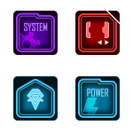

# MacoDeck-Icons-StarCitizen

Conversion of [Starcitizen Streamdeck icons][SC] by [Replic Tuanione][OP] to a MacroDeck icon-pack

Included in this repository is the [#ReadMe.txt][README] as it was in the streamdeck release. This serves in this case as a best-effort licensing as it makes clear the original intend of the owner of the art.

My intend is to also add some profiles to this repo, if that's allowed (don't want to break the MacroDeck iconpack integration). Potentially they'll just live in a long-lived branch, as I'd like to keep them together...

[README]: <./#ReadMe.txt> "The artists document."
[SC]: <https://robertsspaceindustries.com/community-hub/post/star-citizen-icons-for-stream-deck-pq91xgmnw6yxe> "Original release on SC Community hub"
[OP]: <https://robertsspaceindustries.com/community-hub/user/Replic> "Replics' Profile"